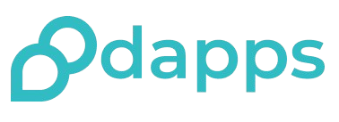

# dapps.co - Speak Freely, Own Your Community, Earn ETH! 🚀



**dapps.co is the first truly censorship-resistant social platform where you can earn real ETH, invest in communities, and speak without fear of arbitrary banning.**

Join a thriving ecosystem where your voice truly matters, your content is undeniably yours, and your awesome contributions get rewarded!

## Why is dapps.co a Game-Changer? 🔑

*   📢 **True Censorship Resistance**: Express your legitimate views freely! Build your following without the nightmare of losing it overnight.
*   💰 **Monthly ETH Rewards**: Ka-ching! Earn consistent monthly income for your valuable contributions. Your earning potential scales with your impact and as your communities explode in growth.
*   📈 **Community Investments**: Invest in what you love! Back communities aligned with your interests. Experience true ownership in the social platforms you help build, with fair pricing powered by a slick bonded curve.
*   🚫 **No Arbitrary Bans**: Say adios to the fear of sudden deplatforming or your content vanishing without a trace or just cause.
*   👥 **Own Thriving Communities**: Become a founder! Create or join vibrant communities with like-minded folks and own a real piece of what you build together.

## How the Magic Happens ✨

1.  **Whip Up Your Profile**: Sign up in a flash and jazz up your profile.
2.  **Discover Your Tribes**: Find and join communities that vibe with your interests, or be a trailblazer and start your own!
3.  **Create, Connect, Conquer**: Unleash your content, chat with others, and watch your social cred and earnings skyrocket with every quality interaction!

## Our Tech Superpowers 💻

This project is built with a powerhouse of modern, robust technologies:

*   **Frontend**: React, Vite, TypeScript (The holy trinity!)
*   **UI**: shadcn-ui, Tailwind CSS (Making things look good, effortlessly)
*   **Routing**: React Router (Guiding you through the app)
*   **State Management/Data Fetching**: React Query (Keeping data fresh and fast)
*   **Authentication**: Privy.io (Secure and seamless logins)

## Get Started & Join the Fun! (Local Development) 🚀

Ready to dive in? Get a local copy up and running with these easy-peasy steps. You'll need [Node.js](https://nodejs.org/) and npm installed (we're big fans of using [nvm](https://github.com/nvm-sh/nvm#installing-and-updating) to manage Node.js versions).

1.  **Clone the Awesome Repo:**
    ```sh
    git clone <YOUR_GIT_URL> # Replace <YOUR_GIT_URL> with your project's Git URL
    ```

2.  **Jump Into the Project Directory:**
    ```sh
    cd dapps.co # Or whatever you've named your project folder!
    ```

3.  **Install the Goodies (Dependencies):**
    ```sh
    npm install
    ```
    Or if you're a Bun enthusiast:
    ```sh
    bun install
    ```

4.  **Launch the Development Rocket!**
    ```sh
    npm run dev
    ```
    This will fire up the Vite development server (usually at `http://localhost:5173`) with hot-reloading. Sweet!

## Share dapps.co with the World! (Deployment) 🌍

Ready to unleash your dapps.co instance? Here's how:

*   **Deploying to Netlify (or similar static hosting heroes):**
    1.  **Build your masterpiece for production:**
        ```sh
        npm run build
        ```
        This command magically conjures a `dist` folder with all your optimized static assets.
    2.  **Ship it!** Deploy the contents of the `dist` folder to Netlify (or your host of choice). You can often just drag and drop the folder in their UI, or link your Git repository for smooth continuous deployment.
    3.  For the nitty-gritty on deploying Vite projects or using custom domains, check out their docs:
        *   [Deploying a Vite Site](https://vitejs.dev/guide/static-deploy.html)
        *   [Netlify Custom Domains](https://docs.netlify.com/domains-https/custom-domains/)

## Got Ideas? Want to Contribute? 🎉

Contributions make the open-source world go 'round, and we massively appreciate them! If you've got a spark of genius or a fix, we're all ears.

Fork the repo, create a pull request, or open an issue with the "enhancement" tag. And hey, don't be shy about starring the project if you like what you see! ⭐

1.  Fork the Project (Go on, you know you want to!)
2.  Create your Awesome Feature Branch (`git checkout -b feature/SuperCoolFeature`)
3.  Commit your Amazing Changes (`git commit -m 'Add some SuperCoolFeature'`)
4.  Push to the Branch (`git push origin feature/SuperCoolFeature`)
5.  Open a Pull Request (Let's see the magic!)

## License Stuff 📜

Distributed under the MIT License. Peek at `LICENSE.txt` for the full legal lowdown.
(Psst! If you don't have a `LICENSE.txt`, now's a great time to add one. MIT, Apache 2.0, or GPL are popular choices!)

---

**We're stoked to see what you build and how you help shape a more open, rewarding, and fun social web! Let's do this!**
